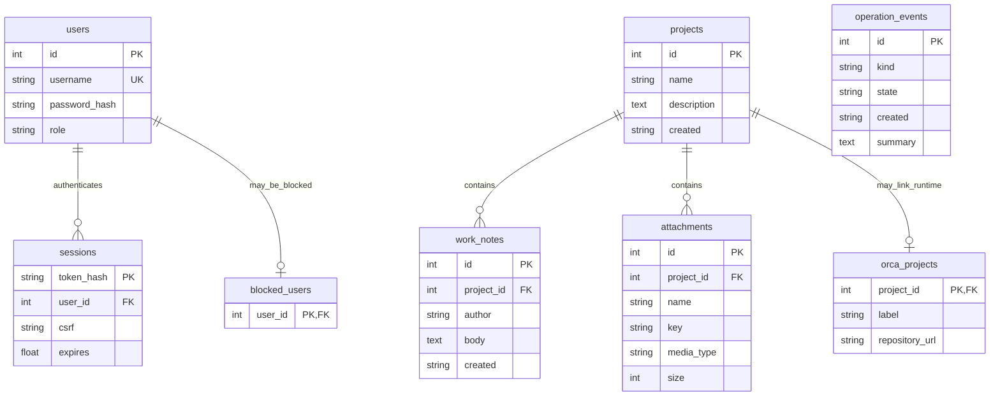

# 포털 데이터 모델

```mermaid
erDiagram
    users ||--o{ sessions : authenticates
    users ||--o| blocked_users : may_be_blocked
    projects ||--o{ work_notes : contains
    projects ||--o{ attachments : contains
    projects ||--o| orca_projects : may_link_runtime
    users {
        int id PK
        string username UK
        string password_hash
        string role
    }
    sessions {
        string token_hash PK
        int user_id FK
        string csrf
        float expires
    }
    blocked_users {
        int user_id PK, FK
    }
    projects {
        int id PK
        string name
        text description
        string created
    }
    work_notes {
        int id PK
        int project_id FK
        string author
        text body
        string created
    }
    orca_projects {
        int project_id PK, FK
        string label
        string repository_url
    }
    attachments {
        int id PK
        int project_id FK
        string name
        string key
        string media_type
        int size
    }
    operation_events {
        int id PK
        string kind
        string state
        string created
        text summary
    }
```

팀 공동 포털이므로 로그인한 팀원끼리 프로젝트·메모·첨부를 공유한다. 사용자별 비공개 프로젝트 격리는 구현 범위에 없다. 모든 SQL 값은 ORM/파라미터로 전달한다.
Orca의 내부 데이터베이스와 AI 자격증명은 이 DB에 포함하지 않는다.
